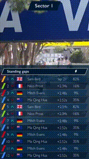
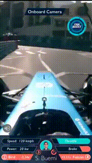

# Trackeporter

## Team Name: nUXburgring

## Participating theme: UI/ UX challenge 2 – second screen viewing

Trackeporter is a prototype android application designed for the round 2 submission of the `#UnitedByHCL` challenge. Taking on the problem statement, the app features 4 different camera feeds and aims to create a seamless, engaging and complete experience for the fans at the race stands. 

---

## Demo Video URL: *insert link here*

---

## Topics

- [Introduction + understanding of the problem](#introduction-and-understanding-of-the-problem)
- [Designing the app](#designing-the-app)
    - [UX](#user-experience)
    - [Race footage](#race-footage)
    - [UI](#user-interface)
        - [UI: Images](#images)
        - [UI: Navigation](#navigations)
- [Our plan for the finals](#our-plan-for-the-finals)
- [Tech Stack](#tech-stack)
- [Interfacing the network with the app](#interfacing-the-network-with-the-app)
- [Team Details](#team)

---

## Introduction and understanding of the problem

Being avid motorsports fans ourselves, we understand how important is having perspectives from different cameras. The simple addition of on-board cameras brought so much excitement to race viewing in the recent years.

We have never seen a race live, but can't help but wonder if the race goers get to see as well-produced version of the race we see on TV with feeds from cameras from multiple sectors, chicane, the famous Steve Slater commentary and on-board cameras with team radio chatters. The experience of watching a race live must be surreal, but with an added ability to see through different sectors of the race track and switch through multiple driver cameras using just your phone will add multiple folds into the experience.

Formula E represents technology in the world of racing and adding a trackside viewing will be a giant step in the recovery of the general falling popularity of motorsports.

With a Formula E circuit just short of 2 kms in size, a fan in the stands is bound to miss out on some of the action. For example, if there is a very competitive duel on the track, the fan has no choice but to wait for the cars to go past his stand to see it. The large screens on the track is often too far away and has to bear the glare of the bright light.

Another challenge with designing a smartphone app is to consider the smartphone as a multi-function device. The user is bound to get notifications, open up and switch between other apps. It is very important to think about the preferred phone orientation for a live stream content.

---

## Designing the app

### User Experience

While putting down the structure and deciding the UX of the app, we’ve put ourselves in the shoes of a race goer and designed a light, seamless and easy to use application. We’ve taken some strong calls on the UX structure and elements to best suit a Formula E fan.

**Vertical full screen video feed**:

One of the early decisions we’ve made is to move away from the traditional landscape video viewing mode because it directly leads to bad user experience. The race goer will receive notifications, open and switch between multiple apps, make/ receive calls, often open up the camera to capture moments – all this along with watching the race. A landscape video viewing mode means that a user will be constantly changing his phone orientation from landscape to portrait and back. This is a huge red flag according to us leading to a bad experience. 

Besides, vertical full screen video is highly engaging, and its adoption is exponentially on the rise. Vertical video is the format of the smartphone, it feels right, it looks right. Snapchat pioneers in it, and both Facebook and Youtube also have extended large support for it. Apart from Snapchat, Meerkat, Line and WeChat have vertical videos as their native format. Here are some other interesting pointers backing the vertical video:

- Smartphone users hold their phone vertically for about 94% of the time
- Vertical video compares to a 9x completion rate compared to horizontal videos 
- 29% of videos on smartphone today are vertical videos vs 5% back in 2012

Designing the app in the natural smartphone usage orientation could be significant in retaining and engaging the users in the app. The ability to hold the phone with one hand is another significant advantage we see with a race goer. 

**Direct views**:

The app is designed with a fast and clean look sporting 4 screens (4 feeds) in a circular loop. The race goer is directly taken to the first feed and swipes to see the next or previous feeds.

Providing a consolidated view (where a user has a choice of 4 feeds on a screen) will add to the complexity by having the user to navigate between individual camera feeds and consolidated view. To overcome this, we have designed a direct view with easy navigation. In other words,

- With direct view, 4 video feeds – view it in 4 steps
- With a consolidated view, 4 video feeds – view it in minimum of 8 steps

**Swipe and scroll**:

Keeping in mind the amount of events happening on the race track, we’ve stuck to the basic swipe and scroll interactions within the app.

- **Left/ right swipe** – to go to next/ prev video feed
- **Up/ down swipe** – to pull up more content about the live race
- **Scroll** – to see even more content

---

### Race footage

We’ve chosen the 4 feeds as 3 sector views + 1 on-board cam view. The image on the right shows the race track divided into 3 sectors namely sector 1, sector 2 and sector 3. For the footage, we’ve taken the full video of the Monaco eprix 2017 from Youtube and edited to purpose with 2 things in mind – to remove most on-screen displays and to create an engaging 2 mins footage for every feed. 

[**Click here to view the footages**](https://drive.google.com/drive/folders/0B2o0eni3ZjlROVFTWU1CZngxTFk)

---

### User Interface

We have designed a very sporty and racey UI for the app and have improved the designs with every iteration having put a lot of thought to the color schemes, shapes, text overlays, representation of key elements on the screen among others. 

We started with simple wireframes that you see on image 1 and designed its UI (image 2, 3) with image 3 as the final UI for the first round.

### Images

| Image 1       | Image 2           | Image 3  |
| ------------- |:-------------:| -----:|
|       |  |  |  

**Note**: On getting selected for the second round, we have rethought our design completely to up the ante. Image 4 is the new design mock-up and image 5 represents first version of the UI and the final screens represented by [images 6 to 11](#images-6-to-11).

 
                   

**Note**: Final screens below

#### Images 6 to 11

  

  

#### Elements on the screens:

Most of the elements used in the designs are self-explanatory and easy to comprehend to any formula E fan. The only different notation we have used is to represent battery percentage in a visually appealing manner.

Both these icons denote battery % left in the car. A driver has to change 2 cars during the race and hence we’ve used the two cars to denote the same in the detailed view.

**Image 6**

The default screen. The app opens up with sector 1 view with the race line-up.  Similar screens for sector 2 and sector 3 with different camera feeds. The leader board on the bottom auto-rotates to show the next 3 drivers every few seconds.

**Image 7**

Swipe up on the sector view to see the complete leader board. Within the half screen layover area with content, scroll up or down to check the complete list.

**Image 8**

Fastest lap details. Fades out within a few seconds

**Image 9**

On-board camera feed of the chosen driver.

**Image 10**

Swipe up the onboard view to view more details about the particular driver. The sec 1, sec 2, and sec 3 columns represent the sector on sector time gain/ lost between the current driver and ones adjacent to him.

**Image 11**

Click on the ‘Select driver’ on onboard detail view to view the driver’s onboard cam feed. Within the half screen layover area with content, scroll up or down to check the complete list.

 
### Navigations:

Keeping in mind the user’s involvement in the race and multiple uses of the smartphone, we’ve designed simple navigation gestures throughout the app. All the interactions in the app are illustrated here.

  

**Comments**

*Left*: Navigating between multiple sector/ on-board cam views.

*Center*: Swipe up the sector screens to see the full leader board

*Right*: Swipe up the on-board screen to see more details about the driver and change the on-board feed to another driver. Note that for this prototype submission we have not implemented the change driver module. 

 

**Comments**

*Left*: The position switch animation on the leader board screen. Note that for this prototype submission we have not implemented the leader board animation module.

*Right*: The fan boost icon animates on the screen when a driver activates it. Note that for this prototype submission we have not implemented the fan boost module.

**Comments**

The profile picture of the driver animates on the on-board cam screen when there’s communication over team radio. On clicking the profile picture, a user can listen to the radio. Note that for this prototype submission we have not implemented the team radio module due to unavailability of separate team radio feeds. 

---

## Our plan for the finals

For the scope of the prototype app, we have designed and developed the above mentioned screens/ features in the span of the 2 weeks provided. But as we’ve been so invested into the problem statement, we have come up with a bunch of things we plan to implement for the finals, if we selected for it.

Collection centre: A race is filled with amazing and exciting moments which no one wants to miss. We plan to build a collection centre where we’ll store all the important events for anyone to come back and view. A user can share these moments on their social media when they switch from the connected LAN to their private networks

Capture image/ video from within the app: The app doubles as a camera app as the feed is most probably similar to the pictures/ videos a user takes. The clips are saved to gallery. So now the user can take pictures of even the sector where he is not sitting

Video controls: Give the user an ability to rewind specific amount of time and continue watching the feed among other controls

Give more content: Add race info, starting grid, chequered flag animation, race theme based UI among others

Suggestive viewing: Based on what everybody else in the race is watching, we’ll suggest use to switch to any particular screen

Fan Boost: Cast your fan boost vote right in the app

Implement driver cam switch, team radio, leader board animation

---

## Tech Stack

---

## Interfacing the network with the app

The feeds will be stored into a central venue controller system which interacts with the mobile app on the user’s smartphone using LAN through video feed requests. The event venue controller system can then provide the multiple video feeds from the variety of locations to the requesting mobile devices. To assist the systems, the video will route through the multiple video CDNs placed around the circuit for load balancing. In the background, we’ll use multi-cast routing technique to support a triple play service like in the IPTV protocol which separates video, content and voice traffic and transmit with weight based logic. Dedicated WLANs will be used for each of them. Multicast is a well-established bandwidth conserving technology. These finally connect to the access points through wireless controllers. The users connect to the multiple access points available to them to enjoy the parallel streaming of the live race. 

We will implement APIs from three categories:

- MediaStream - allows the client (e.g., the web browser) to access the stream
- RTCPeerConnection - enable audio or video data transfer with bandwidth management
- RTCDataChannel - enables peer-to-peer communication for any generic data

Note: For the scope of this prototype, we have not implemented the network and supporting integrations. For the finals, we can implement a proof of concept. 

---

## Team

We are three friends who studied together in college and worked on multiple projects before this hackathon bringing a variety of skills and experience to the table. We’ve participated in competitions and hackathons before as a team and won accolades as well. Listing down the summary of each team member.

**Subramanian Ramvijji**

Having picked up experience working with InMobi and Mu Sigma, Subramanian has always embraced his hacker spirit and built multiple tech projects both in college and post that too. He specialises in data analytics these days, but brings in solid ideation and problem solving skills, product development, front end development and a good design understanding as well.

- Winner, Sequoia Hack 2014
- World Finalist, University Mobile Challenge 2014, GSMA Mobile World Congress
- Winner, Snyxius App Idea Challenge
- Runner-up, ITU Young Innovators Refugee Challenge

**Prashanth Reddy**

Prashanth is the founder of StudyOwl & Developer Weekend, a sprawling community of tech influencers teaching children to code. He brings a strong tech background with him having developed over 4 Android and 7+ web apps over the last 4 years. He specialises in full stack and mobile development.

- Winner, Sequoia Hack 2014 
- World Finalist, University Mobile Challenge 2014, GSMA Mobile World Congress
- Winner, Snyxius App Idea Challenge
- Intuit – Txtweb developer of the year, 2014

**Sudhanshu Passi**

Keeping his tools diverse, Sudhanshu has always focused on making things easily consumable and intuitive. Coming from a computer science background and keeping an interest in visual design helps him get the best of both worlds. These days you can find him making deep learning systems for Cowrks, but for this hackathon is working as a designer.
